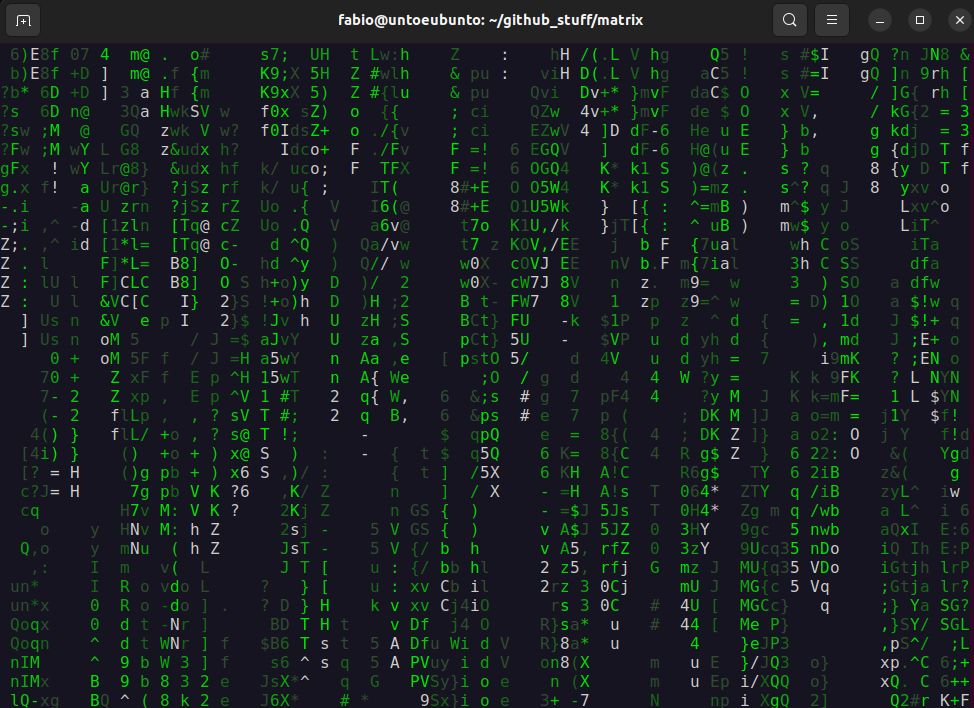

# Matrix

Matrix-like program for LINUX terminal.

The routine is written in C. The only additional library required is ncurses; if you do not have it installed on your LINUX system, please consider following [these simple instructions](https://www.cyberciti.biz/faq/linux-install-ncurses-library-headers-on-debian-ubuntu-centos-fedora/ "Link for ncurses").

To compile and run the code in LINUX (only gcc and ncurses are required), use the following command:

```bash
gcc matrix.c -o exe -O2 -Wall -lncurses
./exe
```

DISCLAIMER: This procedure was tested only on ubuntu 22.04, but it should work also on other distros.

Hereafter you can find a snapshot of the program during the execution:


